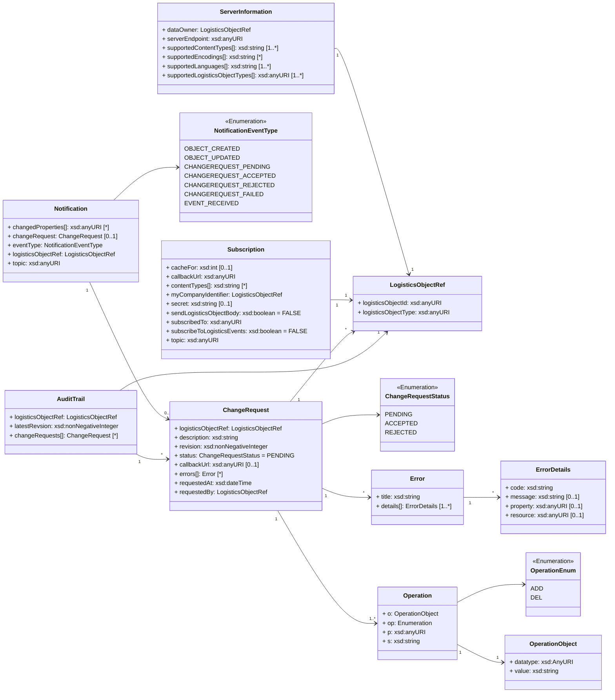

# ONE Record API Class Diagram

**Version:** 2.0.0-dev **Status:** Draft; not yet approved by the COTB / CSC

```mermaid
classDiagram   
    direction LR 
    AuditTrail "1" --> "1" LogisticsObjectRef
    AuditTrail "1" --> "*" ChangeRequest
    ChangeRequest --> ChangeRequestStatus        
    Notification --> NotificationEventType
    Operation --> OperationEnum
    ChangeRequest "1" --> "*" LogisticsObjectRef
    ChangeRequest "1" --> "*" Error
    Error "1" --> "*" ErrorDetails
    Subscription "1" --> "1" LogisticsObjectRef
    ServerInformation "1" --> "1" LogisticsObjectRef
    
    Notification "1" --> "0..1" ChangeRequest
    ChangeRequest "1" --> "1..*" Operation
    Operation "1" --> "1" OperationObject

    class AuditTrail{
        + logisticsObjectRef: LogisticsObjectRef
        + latestRevsion: xsd:nonNegativeInteger
        + changeRequests[]: ChangeRequest [*]
    }   

    class ChangeRequest{
        + logisticsObjectRef: LogisticsObjectRef                
        + description: xsd:string 
        + revision: xsd:nonNegativeInteger
        + status: ChangeRequestStatus = PENDING
        + callbackUrl: xsd:anyURI [0..1]
        + errors[]: Error [*]        
        + requestedAt: xsd:dateTime         
        + requestedBy: LogisticsObjectRef    
    }    
   
    class ChangeRequestStatus{
        <<Enumeration>>
        PENDING
        ACCEPTED
        REJECTED
    }
    class NotificationEventType{
        <<Enumeration>>
        OBJECT_CREATED
        OBJECT_UPDATED
        CHANGEREQUEST_PENDING
        CHANGEREQUEST_ACCEPTED                
        CHANGEREQUEST_REJECTED
        CHANGEREQUEST_FAILED
        EVENT_RECEIVED
    }
    
    class Error{
        + title: xsd:string
        + details[]: ErrorDetails [1..*]
    }
    
    class ErrorDetails{
        + code: xsd:string
        + message: xsd:string [0..1]
        + property: xsd:anyURI [0..1]
        + resource: xsd:anyURI [0..1]
    }

    class LogisticsObjectRef{
        + logisticsObjectId: xsd:anyURI
        + logisticsObjectType: xsd:anyURI
    }

    class Notification{
        + changedProperties[]: xsd:anyURI [*]
        + changeRequest: ChangeRequest [0..1]
        + eventType: NotificationEventType
        + logisticsObjectRef: LogisticsObjectRef
        + topic: xsd:anyURI
    }
    class Operation{
        + o: OperationObject
        + op: Enumeration
        + p: xsd:anyURI
        + s: xsd:string
    }
    class OperationEnum{
        <<Enumeration>>
        ADD
        DEL
    }
    class OperationObject{
        + datatype: xsd:AnyURI
        + value: xsd:string        

    }
    class Subscription{
        + cacheFor: xsd:int [0..1]
        + callbackUrl: xsd:anyURI
        + contentTypes[]: xsd:string [*]
        + myCompanyIdentifier: LogisticsObjectRef
        + secret: xsd:string [0..1]
        + sendLogisticsObjectBody: xsd:boolean = FALSE
        + subscribedTo: xsd:anyURI
        + subscribeToLogisticsEvents: xsd:boolean = FALSE
        + topic: xsd:anyURI
    }
    class ServerInformation{
        + dataOwner: LogisticsObjectRef
        + serverEndpoint: xsd:anyURI
        + supportedContentTypes[]: xsd:string [1..*]
        + supportedEncodings[]: xsd:string [*]
        + supportedLanguages[]: xsd:string [1..*]
        + supportedLogisticsObjectTypes[]: xsd:anyURI [1..*]
    }
    
```